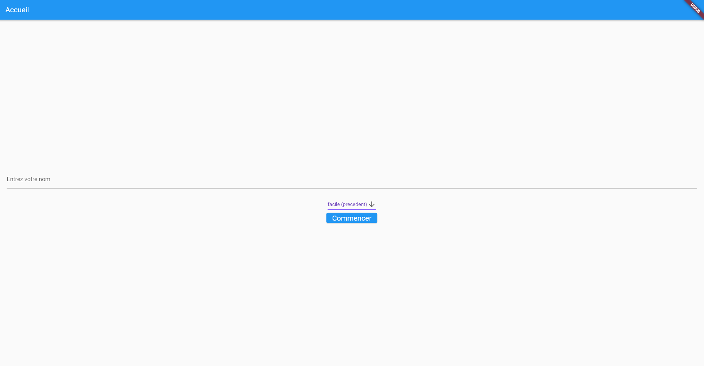
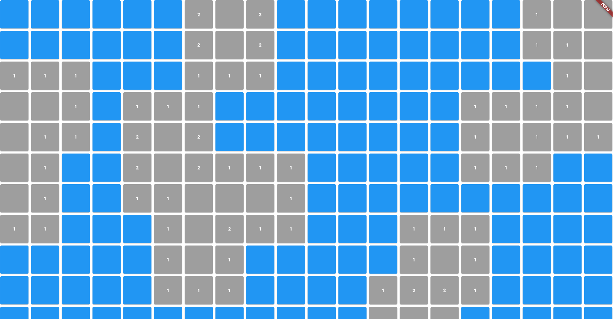
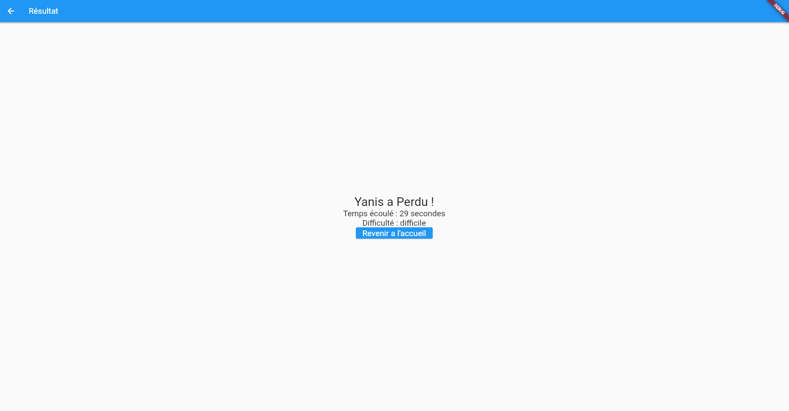

# Démineur Flutter

Cette application est une version du jeu du démineur développée avec Flutter. Le jeu consiste à découvrir toutes les cases vides sans toucher les mines.

## Fonctionnalités

- Interface utilisateur conviviale pour jouer au démineur.
- Difficulté réglable avec trois niveaux : facile, moyen et difficile.
- Chronomètre pour enregistrer le temps écoulé pendant la partie.
- Affichage du résultat et du temps écoulé à la fin de la partie.
- Possibilité de revenir à l'écran d'accueil pour commencer une nouvelle partie.

## Captures d'écran

## Configuration et installation

1. Assurez-vous d'avoir Flutter installé sur votre machine.
2. Clonez ce dépôt avec la commande suivante :
git clone https://github.com/YanisHlali/demineur-flutter.git
3. Accédez au répertoire du projet :
cd demineur-flutter
4. Installez les dépendances du projet en exécutant la commande suivante :
flutter pub get
5. Exécutez l'application avec la commande suivante :
flutter run

## Contribuer

Les contributions sont les bienvenues ! Si vous souhaitez contribuer à ce projet, veuillez suivre les étapes suivantes :

1. Forker le projet
2. Créez une nouvelle branche (`git checkout -b feature/nouvelle-fonctionnalité`)
3. Faites vos modifications et effectuez les validations (`git commit -am 'Ajouter une nouvelle fonctionnalité'`)
4. Poussez les modifications vers votre branche (`git push origin feature/nouvelle-fonctionnalité`)
5. Ouvrez une demande d'extraction (pull request) pour les modifications proposées

## Auteurs

- Yanis HLALI - [yanis.hlali@gmail.com](mailto:yanis.hlali@gmail.com)

## Licence

Ce projet est sous licence [MIT](LICENSE).
